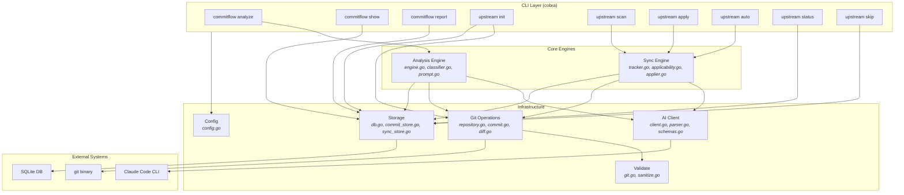
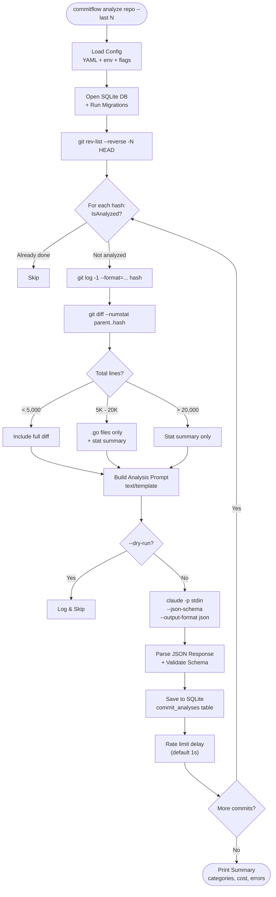
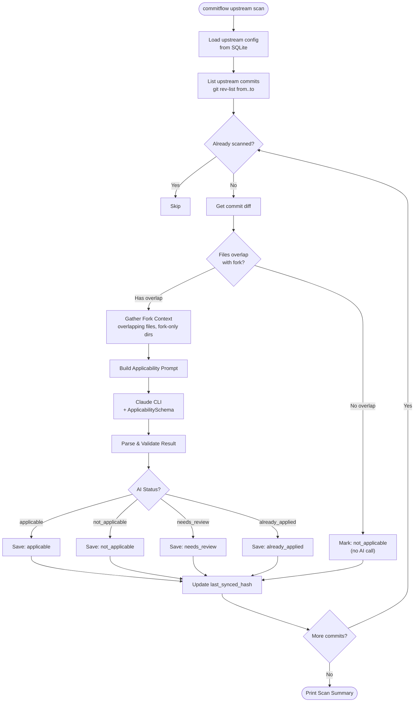
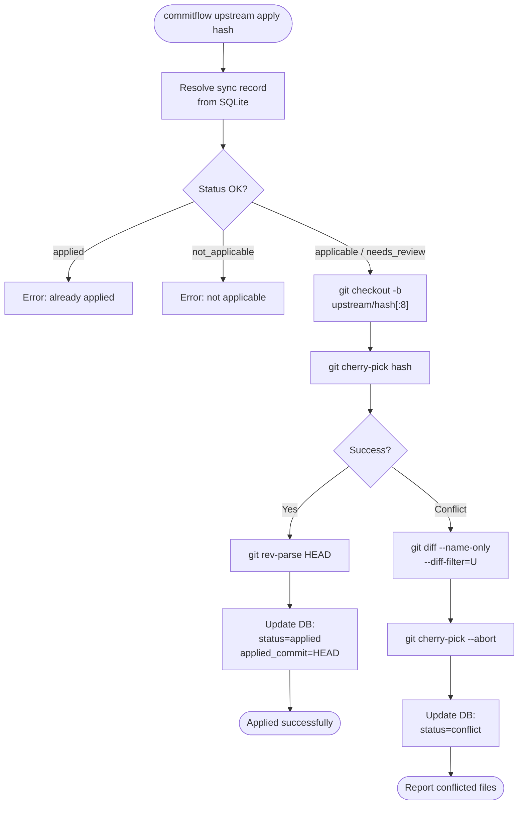
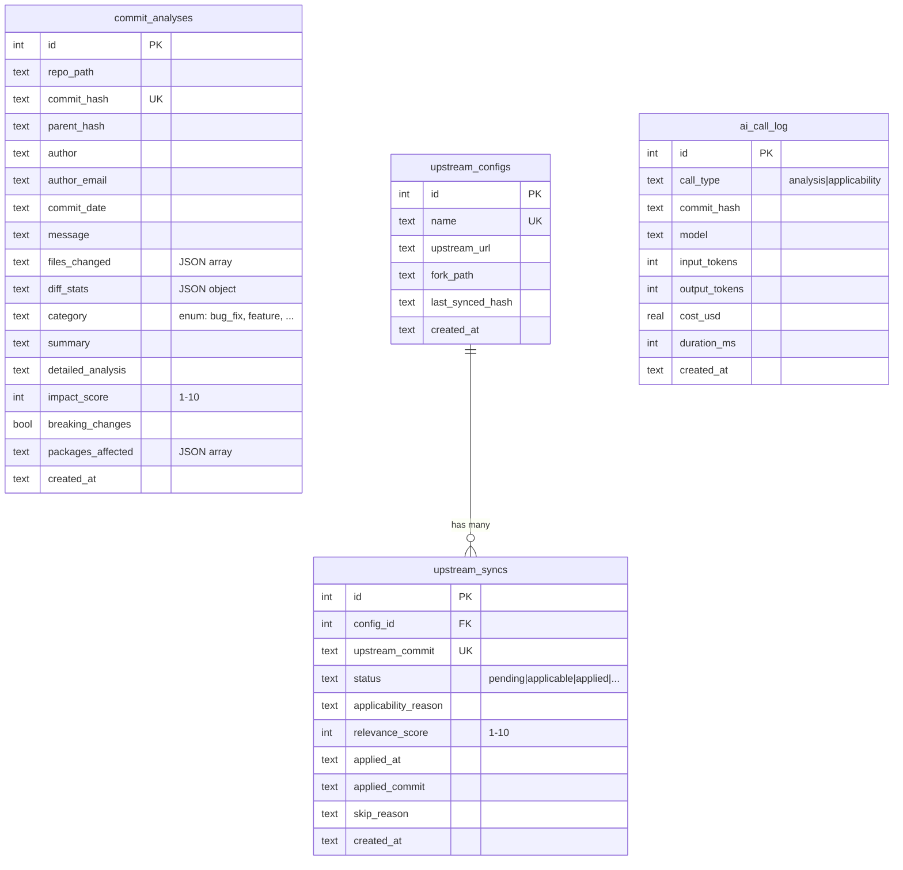
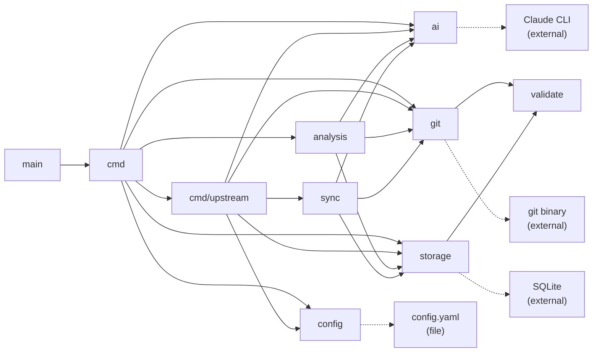
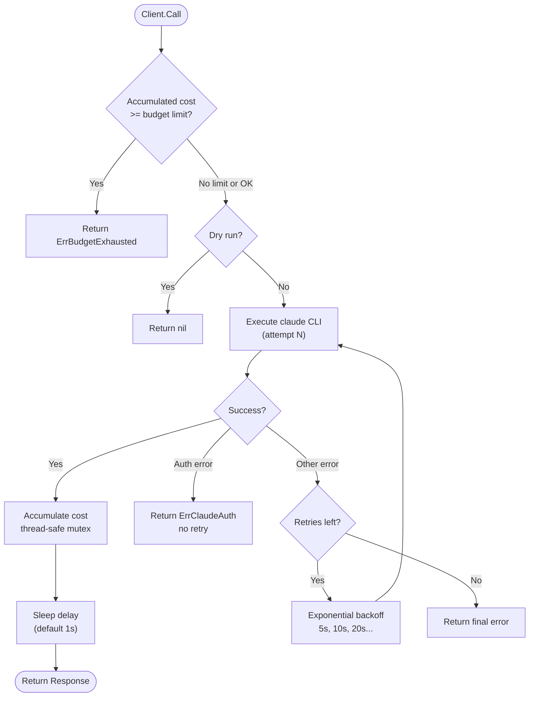
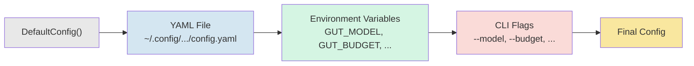

# Architecture Diagrams

Visual architecture reference for commitflow. All diagrams use [Mermaid](https://mermaid.js.org/) syntax.

---

## System Overview

---

## Commit Analysis Pipeline

---

## Upstream Sync Pipeline

---

## Cherry-Pick Apply Flow

---

## Data Model

---

## Package Dependency Graph

---

## AI Client Retry & Budget Flow

---

## Configuration Loading Priority

*Rightmost source wins when values conflict.*
